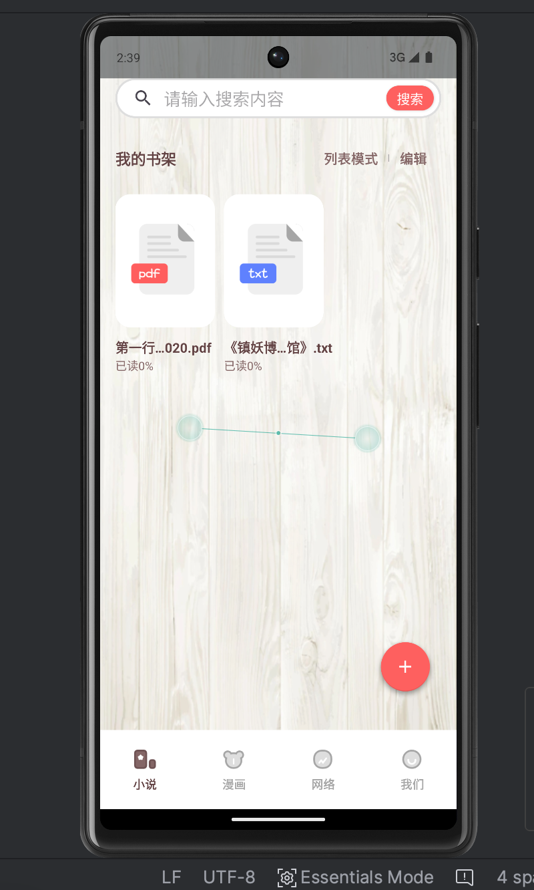
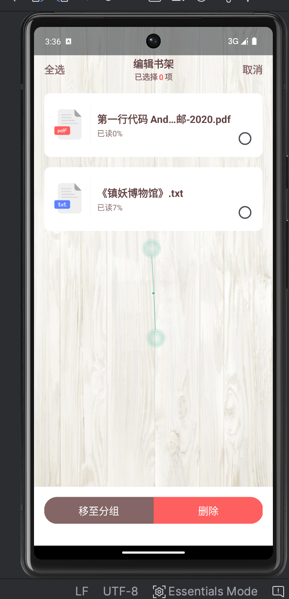

# Jy-Book是一个本地阅读器App
# 1.我的书架、列表、九宫列表、编辑书架、移动分组的CURD的操作
# 2.搜索书架内容，导入txt、pdf、Link、远程文件
# 3.PDF:全屏上下，触摸效果，展示页数，跳转章节内容
# 4.书架展示:百分之百进度（已读、未读、0-100）
# 5.TXT
## 5.1目录：共%章，过滤章节，选择章节、定位、排序
## 5.2物理键:返回动作
## 5.3阅读界面:阅读格式、过滤题名、加载效果
## 5.4进度:上一章，下一章，滑动
# 6.夜间/日光
## 6.1翻页:覆盖、上下、仿真、平移
## 6.2设置:亮度、字号、背景、行距、锁屏、音量健翻页、阅读显示状态栏、自动阅读
# 7.登录\注册:用户未登录和登录的头像
# 8.我的设置：允许通知、允许震动、应用权限、清除缓存、锁屏动态权限
# 9.检查更新
# 以及扩展解析生态，参考Nimyears-设计解析导入文档

# 
# 

